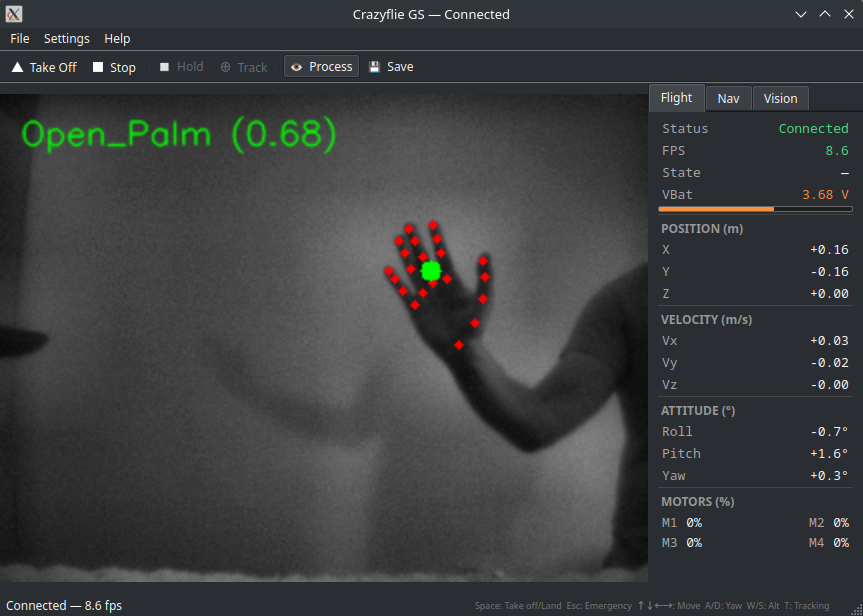
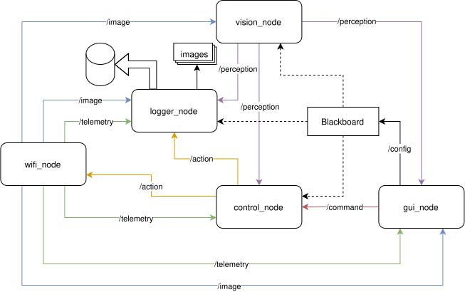
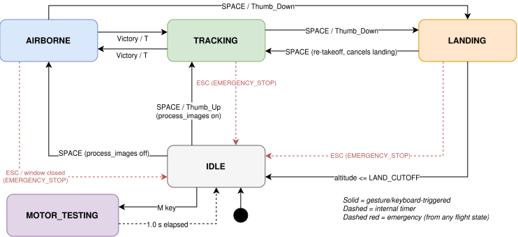

# crazy-hand

Gesture-controlled flight system for a [Crazyflie 2.1](https://www.bitcraze.io/products/crazyflie-2-1/) equipped with an [AI-deck](https://www.bitcraze.io/products/ai-deck/) — custom STM32 and GAP8 firmware, plus a Python ground station.

The AI-deck's GAP8 processor captures a 324×244 grayscale camera feed and streams it over WiFi to the ground station, where [MediaPipe](https://ai.google.dev/edge/mediapipe/solutions/vision/gesture_recognizer) classifies hand gestures in real time. Recognised gestures trigger flight commands; hand position drives lateral, altitude, and distance tracking. Telemetry is logged to [InfluxDB 3 Core](https://docs.influxdata.com/influxdb3/core/) and visualised in [Grafana](https://grafana.com).

The ground station is a multi-process Python application. Nodes communicate via [iceoryx2](https://github.com/eclipse-iceoryx/iceoryx2) shared-memory IPC, a zero-copy pub/sub for high-throughput data (images, telemetry) and a typed blackboard for live runtime configuration.



## ARCHITECTURE



**Pub/sub topics (iceoryx2):**

| Publisher      | Topic         | Subscriber(s)                             |
| -------------- | ------------- | ----------------------------------------- |
| `control_node` | `/action`     | `logger_node`, `wifi_node`                |
| `gui_node`     | `/command`    | `control_node`                            |
| `vision_node`  | `/perception` | `control_node`, `gui_node`, `logger_node` |
| `wifi_node`    | `/telemetry`  | `gui_node`, `logger_node`                 |
| `wifi_node`    | `/image`      | `gui_node`, `logger_node`, `vision_node`  |

**Blackboard (iceoryx2 key-value, runtime config):**

| Writer     | Service   | Readers                                          |
| ---------- | --------- | ------------------------------------------------ |
| `gui_node` | `/config` | `control_node`, `vision_node`, `logger_node`     |

18 typed entries (flight speed, yaw rates, altitude limits, gesture thresholds, CLAHE toggle, tracking gains). All editable live via **Settings → Settings…** without restarting nodes.

**Application state machine:**



## INSTALLATION

### Dependencies

- [Python 3.12+](https://www.python.org/downloads/)
- [Crazyradio PA](https://www.bitcraze.io/products/crazyradio-pa/) USB dongle
- [Docker](https://docs.docker.com/engine/install/ubuntu/)
- [Grafana](https://grafana.com/oss/grafana/)
- [InfluxDB 3 Core](https://docs.influxdata.com/influxdb3/core/install/)
- Build tools (make, gcc, etc).

### Python environment

Create virtual environment and install dependencies:

```bash
python3 -m venv .venv
source .venv/bin/activate
pip install .
```

### Mediapipe

Download [HandGestureClassifier](https://storage.googleapis.com/mediapipe-models/gesture_recognizer/gesture_recognizer/float16/latest/gesture_recognizer.task) and place it in the `data` folder.

### Grafana

Follow steps in [Install Grafana](https://grafana.com/docs/grafana/latest/setup-grafana/installation/debian/).

To [start Grafana](https://grafana.com/docs/grafana/latest/setup-grafana/start-restart-grafana/), execute the following statements to configure Grafana to start automatically using systemd:

```bash
sudo /bin/systemctl daemon-reload
sudo /bin/systemctl enable grafana-server
```

Start grafana-server by executing:

```bash
sudo /bin/systemctl start grafana-server
```

Open [Grafana server](https://grafana.com/docs/grafana/latest/setup-grafana/sign-in-to-grafana/).

Grafana UI: <http://localhost:3000>

To connect InfluxDB 3 as a datasource:

1. **Connections → Data sources → Add → InfluxDB**
2. Set **Query language**: `InfluxQL`
3. Set **URL**: `http://localhost:8181`
4. Set **Database**: `crazyflie`
5. Set **HTTP Method**: `GET`
6. Under **Custom HTTP Headers**, add header `Authorization` with value `Bearer <your_token>` (token from `.env`)
7. Click **Save & test**

Import the dashboard: **Dashboards → Import → Upload JSON** → select `grafana/dashboard-influxdb3.json`. The client writes to three tables: `telemetry`, `action`, `perception`.

### InfluxDB 3 Core

[InfluxDB 3 Core](https://docs.influxdata.com/influxdb3/core/install/) is an open-source time-series database (MIT licence). Install:

```bash
curl -O https://www.influxdata.com/d/install_influxdb3.sh && sh install_influxdb3.sh
```

`main.py` starts InfluxDB 3 automatically on launch. To start manually:

```bash
INFLUXDB3_NODE_ID=your-node-id influxdb3 serve --node-id-from-env=INFLUXDB3_NODE_ID \
  --object-store=file \
  --data-dir ~/.influxdb \
  > ~/.influxdb/logs/server.log 2>&1 &
```

Create an admin token on first run and store it in `.env`:

```bash
influxdb3 create token --admin
```

Create `.env` in the project root with:

```bash
INFLUXDB3_TOKEN=apiv3_...
INFLUXDB3_NODE_ID=your-node-id
```

InfluxDB 3 API: <http://localhost:8181>

## COMPILE FIRMWARE AND FLASH

### app - STM32 firmware

This firmware depends on the Crazyflie firmware repository. First clone it:

```bash
git clone https://github.com/bitcraze/crazyflie-firmware.git ~/git/PUBLIC/crazyflie-firmware
```

Compile app firmware:

```bash
cd firmware/app
make clean
make -j

# Override default CRAZYFLIE_BASE location
make CRAZYFLIE_BASE=/path/to/repo
```

Flash app firmware using Crazyradio:

1. Turn the Crazyflie off.
2. Hold the power button ~3 seconds to enter bootloader mode (blue LEDs blink).
3. Run:

```bash
make cload
```

### ai - AI-deck GAP8 firmware

Pull the Docker image:

```bash
docker pull bitcraze/aideck
```

Build the AI-deck firmware (inside Docker):

```bash
cd firmware

# incremental build
make build

# full rebuild
make rebuild

# build with debugging enabled
make build DEBUG=1

# full rebuild with debugging
make rebuild DEBUG=1
```

Output image:

```text
ai/BUILD/GAP8_V2/GCC_RISCV_FREERTOS/target.board.devices.flash.img
```

#### Image encoding

Controlled by flags in `firmware/ai/Makefile`. Default is RAW. To switch to JPEG:

```makefile
# Comment out RAW, uncomment JPEG (CONFIG_GAP_LIB_JPEG stays on either way):
# APP_CFLAGS += -DRAW_ENCODING
APP_CFLAGS += -DJPEG_ENCODING
CONFIG_GAP_LIB_JPEG = 1
```

Then rebuild with `make rebuild`.

#### Flashing via Radio

We support two modes of flashing via the Crazyradio PA dongle:

1. **Warm Boot (`make flash`) [Default]**:
   Use this if the Crazyflie is already running its normal firmware. It will connect to the firmware, automatically reboot the drone into bootloader mode, flash the AI-deck, and restart it.

   ```bash
   make flash

   # Override radio URI (default is radio://0/80/2M/E7E7E7E7E7)
   make flash URI=radio://0/80/2M/E7E7E7E7E7
   ```

2. **Cold Boot (`make flash-cold`)**:
   Use this if the Crazyflie is already in bootloader mode (e.g. blue M2 LED blinking, listening on bootloader channel `0`) or if a previous flashing attempt was interrupted.

   ```bash
   make flash-cold
   ```

#### Flashing via JTAG

To flash directly using a JTAG cable (e.g. Olimex ARM-USB-OCD-H):

```bash
make flash-jtag
```

#### Clean Build Artifacts

```bash
make clean
```

## CONNECT TO AI-DECK

Before running the client, connect your host to the AI-deck's WiFi access point. The AI-deck broadcasts its own AP when powered on. The client connects via TCP to `192.168.4.1:5000`.

## RUN CLIENT

```bash
python -m client.main
python -m client.main --sim
python -m client.main --help
```

- **Process images** (`Ctrl+P`) — enables gesture recognition and hand tracking overlay.
- **Settings** (`Settings → Settings…`) — live-tune flight speed, yaw, altitude limits, gesture thresholds, and tracking gains without restarting.
- Drone takes off directly into **tracking mode** (hand following). Press `T` to toggle tracking off/on.
- **Simulation mode** (`--sim`) — runs without a drone: synthetic telemetry, no WiFi required. Useful for testing the UI and control logic.

### Data

Images and processed frames are saved to:

```text
data/images/       # raw frames (when Save Images is enabled)
data/processed/    # vision overlay frames (gesture landmarks, labels)
```

Telemetry, actions, and perception events are streamed to InfluxDB 3 in real time.

## GESTURES

With **Process Images** enabled, MediaPipe classifies hand gestures from the live camera feed.

| Gesture      | Action                                   |
| ------------ | ---------------------------------------- |
| `Thumb_Up`   | Take off (from ground only)              |
| `Thumb_Down` | Land                                     |
| `Victory`    | Toggle hand-tracking mode on / off       |

Gesture confidence threshold, debounce, and hysteresis are tunable live in **Settings → Gesture**.

## PILOTING

### Flight

| Key              | Action                                            |
| ---------------- | ------------------------------------------------- |
| `Space`          | Take off / Land                                   |
| `Esc`            | Emergency stop — cuts motors immediately          |
| `T`              | Toggle hand-tracking mode                         |
| `C`              | Stabilise — stop lateral motion, hold altitude    |
| `M`              | Motor test — spins briefly on ground, won't lift  |

### Movement (airborne only)

| Key              | Action                                            |
| ---------------- | ------------------------------------------------- |
| `↑ / ↓`          | Forward / Backward                                |
| `← / →`          | Strafe left / right                               |
| `Shift + ↑↓←→`   | Fast forward / backward / strafe                  |
| `A / D`          | Yaw right / left                                  |
| `Shift + A / D`  | Fast yaw                                          |
| `W / S`          | Altitude up / down                                |
| `Shift + W / S`  | Larger altitude step                              |

### Application

| Key              | Action                                            |
| ---------------- | ------------------------------------------------- |
| `Ctrl+P`         | Toggle image processing (gesture recognition)     |
| `Ctrl+S`         | Toggle image saving                               |
| `Ctrl+/`         | Show keyboard shortcuts                           |
| `Ctrl+Q`         | Exit                                              |

## TROUBLESHOOTING

### Clean Iceoryx2 memory

> **Note:** `client.main` runs this cleanup automatically at startup. Use these commands only when running nodes manually.

```bash
rm -rf /tmp/iceoryx2/*
rm -rf /dev/shm/iox2_*
```

### Crazyradio USB "Access denied (insufficient permissions)" Error

If you get `Failed to flash: [Errno 13] Access denied (insufficient permissions)` when trying to run `cfloader` or flash:

1. Ensure the Bitcraze `udev` rules are installed in `/etc/udev/rules.d/99-bitcraze.rules`:

   ```bash
   # Crazyradio (normal operation)
   SUBSYSTEM=="usb", ATTRS{idVendor}=="1915", ATTRS{idProduct}=="7777", MODE="0664", GROUP="plugdev"
   # Bootloader
   SUBSYSTEM=="usb", ATTRS{idVendor}=="1915", ATTRS{idProduct}=="0101", MODE="0664", GROUP="plugdev"
   ```

2. Make sure your user is in the `plugdev` group:

   ```bash
   sudo usermod -aG plugdev $USER
   ```

3. Unplug the Crazyradio dongle from the USB port and plug it back in so that the permissions are applied to the active device node.
